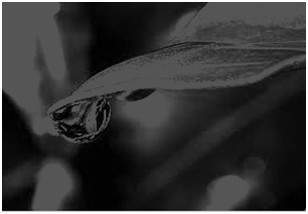
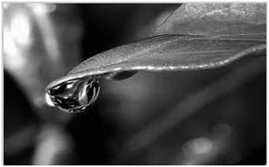

# Image Enhancement Part 1 (Color to grayscale images)

<strong>Please read the entire file and the comments in the files provided before you ask any question.</strong><br>
<strong>You should write your own Makefile to test the code.</strong>


# Learning Goals
You will learn to
* Opening/Writing image files
* Working with Images
* Understand the color scale in images

# Description of Assignment
This assignment requires you to do the following :
1. Open the colored BMP image
2. Convert the colored image to grayscale
3. Save the new image in BMP format

Note: Do not use floating point variables for this assignment. Only use integers for all calculations. Floating point numbers cannot represent a value precisely. This can lead to rounding off errors. For example if x is a very large number and y is significantly smaller then, 

x + y - x and x - x + y can lead to two different outputs.

x + y is taken to be x as y is significantly smaller than x and thus x + y - x = 0

for x - x + y, the output is y. This leads to faulty calculations and erroneous outputs. While testing, remember to use only bmp image files. 

# Grayscale Conversion
Let suppose we have an image :


This colored image has three channels: Red, Green and Blue. A grayscale or greyscale image is one in which the value of each pixel is a single sample representing only an amount of light, that is, it carries only intensity information. Images of this sort, also known as black-and-white or gray monochrome, are composed exclusively of shades of gray. The contrast ranges from black at the weakest intensity to white at the strongest. 

One method for doing this is to get the average of the three channels, so what you do is (red + green + blue)/3 and you get your desired grayscale image. This method is somewhat flawed as the image often turns out to be rather black.



This problem arise due to the fact, that we take average of the three colors. Since the three different colors have three different wavelength and have their own contribution in the formation of image, so we have to take average according to their contribution, not do it using average method. In this assignment, we will use the luminosity method for conversion to grayscale images.

Since red color has more wavelength of all the three colors, and green is the color that has not only less wavelength then red color but also green is the color that gives more soothing effect to the eyes. It means that we have to decrease the contribution of red color, and increase the contribution of the green color, and put blue color contribution in between these two.So the new equation that form is:

New grayscale image = (0.2989 * red + 0.5870 * green + 0.1140 * blue)

According to this equation, Red has contribute 29.89%, Green has contributed 58.70% which is greater in all three colors and Blue has contributed 11.40%. Applying this equation to the image, we get the final grayscale image as:



This is our desired conversion to grayscale. The image is brighter and better distributed.

# Functions you need to complete
In this exercise, you have to complete six functions - `BMP_Open`, `Is_BMPHeader_Valid`,`BMP_Write`, `BMP_Free` in `bmpimage.c`;`ImgToGray` in `bmpfunc.c`; and `main()` in `hw10.c`.
**Do not hardcode the name of the files in your code**

1. `BMP_Open` -  This function takes the name of the file as input, opens up a file. Checks whether the file has right `BMP` header by calling `Is_BMPHeader_Valid` function. If everything is alright, then stores the value of pixels in the `data` . Finally returns BMPImage\* .
2. `Is_BMPHeader_Valid` - Checks whether the input file has right `BMP` header. You can refer to `Intermediate C Programming` to look for the correct checks for the header.
3. `BMP_Write` -  this function writes the output as `BMP` file. You should first write `BMP` header into the file and then you should write the BMP Image data into it.
4. `BMP_Free` - Frees up all the memory allocated for the image.
5. `ImgToGray` - This function takes input as the `BMP` image and then converts the image to `grayscale` (24-bit image with red=blue=green) by setting the red, blue, and green components of each pixel to the value obtained from calling `RGB2Gray` function. The output image should have red=blue=green for all pixels. If this function fails, print `"Error converting to Gray image\n"` and return `EXIT_FAILURE`.
6. `main()` - In this assignment, your main function has the following the specifications- if the arguments != 3 then print "Wrong arguments\n" and return, 1st input name of the input file image. If opening up of this file fails print `Error opening BMP file`, and return `EXIT_FAILURE`, 2nd input output image file name, If file write fails, free memory and return EXIT_FAILURE

### Function already given to you :
**DO NOT modify this function**

`RGB2Gray` : this function takes red, green and blue value of a pixel as input and returns the gray value i.e. a number between 0-255

Note: you will be reusing all the codes used in this assignment, so remember to keep it clean and usable.

---------------------
# Testing your code
Following are the files we provide:
1. `hw10.c` - main file for this assignment.
2. `hw10.h` - Header file of the main file .
4. `bmpimage.h` - Header file, which has definition for the functions and structures you need in this assignment. Do not modify this file.
5. `bmpimage.c` - These contains the functions related to working with BMP images.
6. `bmpfunc.h` - Header file, which has definition for the functions you need in this assignment. Do not modify this file.
7. `bmpfunc.c` - Define your functions in this file. You can use any helper function you need but do not put them in the header file. Do not modify the functions that we have given you.
8. `expectedImages/` - This directory contains the expected output as generated by the commands shown
	1. `expectedRV.bmp` - ./hw10 exampleImages/RV.bmp expectedImages/expectedRV.bmp
	2. `expectedRV2.bmp` - ./hw10 exampleImages/RV2.bmp expectedImages/expectedRV2.bmp
	3. `expectedCondProb.bmp` - ./hw10 exampleImages/CondProb.bmp expectedImages/expectedCondProb.bmp
	4. `expectedRV2Small.bmp` - ./hw10 exampleImages/RV2Small.bmp expectedImages/expectedRV2Small.bmp


# Checking for memory errors
You should also run ./hw10 with arguments under valgrind. To do that, you have to use, for example, the following command:
```
valgrind --tool=memcheck --verbose --leak-check=full --log-file=valgrind.log ./hw10 exampleImages/RV2.bmp expectedImages/expectedRV2.bmp
```

Note that you should use other input arguments to extensively test your function. If you follow the instructions and keep the malloc and free functions in the right place, you should not have memory problems in this assignment.


# Submitting Your code

The command to create zip file is as follows:
```

zip HW10.zip hw10.c bmpfunc.c bmpimage.c

```
<strong>You will not get any credits if the submitted file is not zipped</strong>

# Remember to define test flags:
-DTEST_MAINFUNC -DTEST_FUNCGIVEN -DTEST_IMGTOGRAY -DTEST_HEADERVALID -DTEST_BMPOPENFILE -DTEST_BMPWRITEFUNC -DTEST_BMPFREEFUNC 

